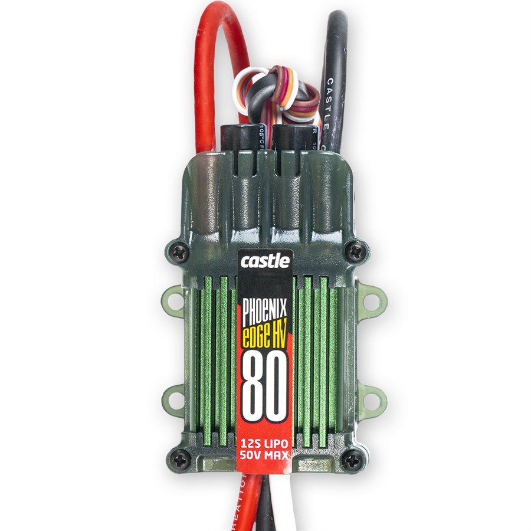
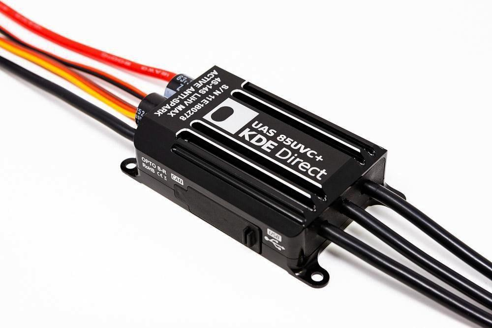

# live_esc
Protocols for reading live telemetry from commercial Electronic Speed Controllers (ESC). This is important in the context of UAV and Drone technology.

|Más información en https://toopazo.github.io/postscyt/Programar-ESC/|
|---|

## Phoenix Edge HV series


The setup for this ESC was
- [Castle Creation: Phoenix Edge HV 80](https://www.castlecreations.com/en/phoenix-edge-hv/phoenix-edge-hv80-esc-010-0105-00)
- [Castle Creation: USB programmer](https://www.castlecreations.com/en/castle-link-v3-usb-programming-kit-011-0119-00)  
- [Castle Creation: Serial Link](https://www.castlecreations.com/en/serial-link-010-0121-00)
- [HolyBro: Pixhawk 4](http://www.holybro.com/product/pixhawk-4/)
- [KDE Direct: KDE 6213XF-185 motor](https://www.kdedirect.com/products/kde6213xf-185)
- [SparkFun: Serial (ttl) to USB](https://www.sparkfun.com/products/15096)
- Laptop with python 3
- 4s2p Battery (two 4S batteries in series => 29.6 V)
- A voltage regulator to power the Pixhawk's servo rail with 5 V

For this type of ESC I made use of the existing repo https://github.com/math2peters/CastleSerialLink
The code from ```math2peters``` works well, but I have not being able to get the ```TTL Serial (with PPM Input)``` mode to work.
Connecting the Pixhawk's port```IO PWM out``` for motor 1 (it could have been any) into pin ```D``` of the Serial Link produces no response from the ESC. There seems to be a problem -on the Castle Creation side- intepreting the throttle signal.       

## KDE UAS series


The setup for this ESC was
- [KDE Direct: KDE-UAS85UVC](https://www.kdedirect.com/collections/uas-multi-rotor-electronics/products/kde-uas85uvc)
- [KDE Direct: Device Manager (software)](https://www.kdedirect.com/collections/uas-multi-rotor-electronics/products/kde-dms?page=specs) 
- [HolyBro: Pixhawk 4](http://www.holybro.com/product/pixhawk-4/)
- [KDE Direct: KDE 6213XF-185 motor](https://www.kdedirect.com/products/kde6213xf-185)
- [Inno-Maker: USB CAN Module](https://www.inno-maker.com/product/usb-can/)
- Laptop with python 3  
- 4s2p Battery (Two 4S batteries in series => 29.6 V)
- A voltage regulator to power the Pixhawk's servo rail with 5 V

The Inno-Maker board was a very convenient way to communicate with ESC from a laptop without having to spend too much work on getting the CAN bus to work.
I implemented the KDECAN protocol as a python class. Tests were successful at retrieving live data.

